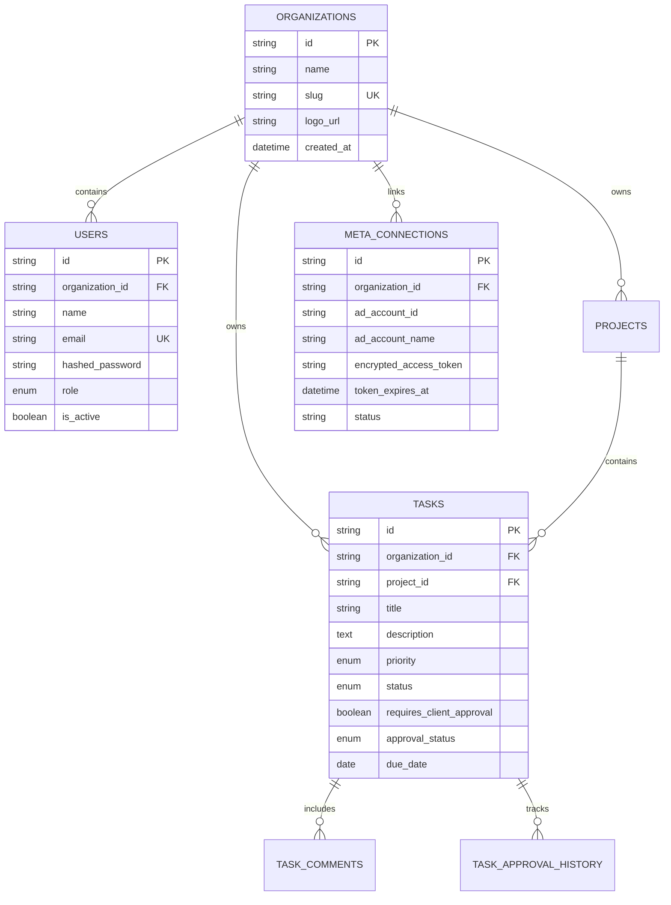

# Database Entity Relationship & Schema Documentation

## Database Schema Overview

**Throttle Client Portal** uses PostgreSQL with Async SQLAlchemy 2.0. Every table enforces organization-level multi-tenancy.

---

## Entity Descriptions

1. **`organizations`**: Master tenant table. Stores tenant name, unique URL slug, and configuration.
2. **`users`**: User account credentials, hashed password, role (`THROTTLE_ADMIN`, `CLIENT_ADMIN`, `CLIENT_MEMBER`, `CLIENT_VIEWER`), and organization FK.
3. **`projects`**: Top-level client campaigns or deliverables.
4. **`tasks`**: Actionable work items, deliverables, and approval items. Includes `priority`, `status`, `requires_client_approval`, and `approval_status`.
5. **`task_comments`**: Timestamped comment discussion entries per task.
6. **`meta_connections`**: Stores encrypted Meta Graph API access tokens, connected ad account details, and sync statuses.
7. **`meta_daily_insights`**: Normalized daily ad performance analytics (spend, impressions, clicks, conversions, ROAS).
